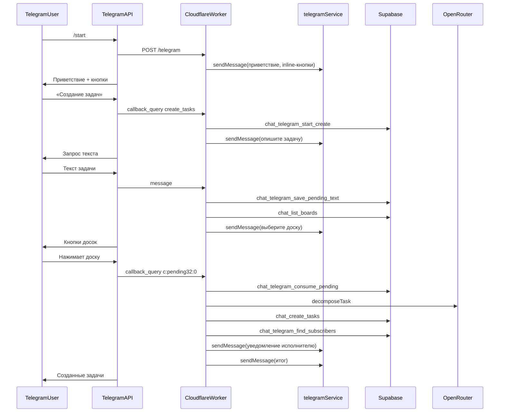
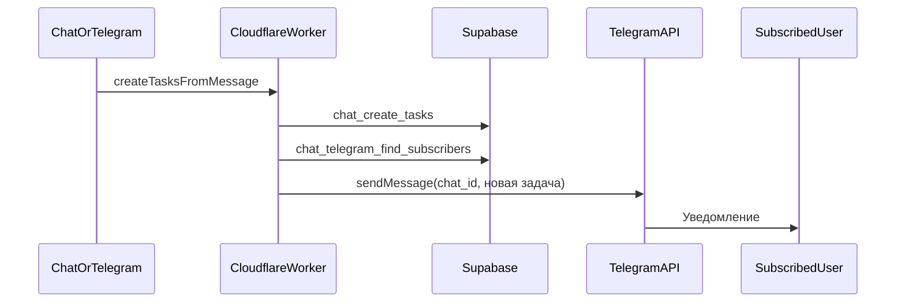

# Telegram-бот — доски и задачи из Supabase

## История изменений

| Коммит | Дата | Описание |
|--------|------|----------|
| `6248218` | 28.06.2026 | Просмотр досок и задач через inline-кнопки |
| `087962f` | 28.06.2026 | Сценарий **«Создание задач»** с отложенным выбором доски, pending в Supabase, общий сервис `taskCreation` |
| — | 28.06.2026 | **Подписка на уведомления**: кнопка toggle, сохранение username, оповещение при назначении задач |

## Кратко

Telegram webhook-бот интегрирован с Supabase и OpenRouter. Пользователь может:

- **Просматривать** доски и задачи через inline-кнопки
- **Создавать задачи** из текста: сначала описание, затем выбор доски — бот разбивает текст на подзадачи и сохраняет их в БД
- **Подписываться на уведомления** — бот сообщает о новых назначенных задачах (сопоставление по `assignee.name` = Telegram username)

### Сценарий просмотра

1. `/start` — приветствие и inline-кнопки **«Получить Boards»**, **«Создание задач»** и **«Получать уведомления»** / **«Отключить уведомления»**
2. **«Получить Boards»** → «Выберите доску:» + кнопки досок
3. Нажатие на доску → список задач с названием и статусом

### Сценарий подписки на уведомления

1. `/start` → **«Получать уведомления»**
2. Бот сохраняет Telegram `username` и `chat_id` в Supabase
3. При создании задачи (из Telegram или `POST /api/chat`) бот ищет подписчиков, у которых `username` совпадает с `assignee.name` (без учёта регистра)
4. Подписанному пользователю приходит сообщение о новой задаче на доске
5. Повторное нажатие (**«Отключить уведомления»**) отписывает пользователя

> Для подписки нужен **username в Telegram**. Он должен совпадать с именем исполнителя в приложении (например, `Person2`).

### Сценарий создания задач

1. `/start` → **«Создание задач»**
2. Бот: «Опишите задачу текстом…»
3. Пользователь отправляет текст → pending сохраняется в Supabase → «Выберите доску, куда сохранить задачи:»
4. Выбор доски → OpenRouter разбивает текст → round-robin назначает исполнителей → `chat_create_tasks`
5. Итог: список созданных задач с исполнителями

> Текст без предварительного нажатия **«Создание задач»** игнорируется — pending создаётся только после кнопки.

Кнопки меню показываются при `/start` и при ошибках конфигурации Supabase. После результатов повторно не отображаются.

## Изменённые и добавленные файлы

| Файл | Назначение |
|------|------------|
| `src/routes/telegram.ts` | Webhook: `/start`, `get_boards`, `create_tasks`, `toggle_notifications`, `board:{uuid}`, `c:{pending32}:{index}` |
| `src/routes/chat.ts` | HTTP `POST /api/chat` — делегирует в `createTasksFromMessage`, отправляет Telegram-уведомления |
| `src/services/telegram.ts` | Клавиатуры, парсеры callback, форматирование списков |
| `src/services/supabase.ts` | RPC досок/задач + pending Telegram + подписки на уведомления |
| `src/services/taskCreation.ts` | Общая логика: decompose → round-robin → createTasks |
| `src/services/taskNotifications.ts` | **Новый.** Поиск подписчиков и отправка уведомлений о назначенных задачах |
| `test/telegram.spec.ts` | Интеграционные тесты (просмотр + создание + подписки) |
| `test/chat.spec.ts` | Тесты HTTP API, включая Telegram-уведомления |
| `docs/supabase-telegram-subscriptions.sql` | SQL: таблица подписок и RPC |
| `docs/commit-telegram-bot.md` | Документация |

## Supabase

### Таблица `chat_pending_telegram_requests`

| Поле | Тип | Описание |
|------|-----|----------|
| `id` | `uuid` PK | Идентификатор pending-запроса |
| `chat_id` | `bigint` | Telegram chat ID |
| `message_text` | `text` nullable | Текст задачи (NULL до ввода пользователем) |
| `status` | `text` | `awaiting_text` → `awaiting_board` |
| `created_at` | `timestamptz` | Время создания |
| `expires_at` | `timestamptz` | TTL (30 минут, продлевается при сохранении текста) |

### Таблица `chat_telegram_subscriptions`

| Поле | Тип | Описание |
|------|-----|----------|
| `chat_id` | `bigint` PK | Telegram chat ID |
| `username` | `text` | Telegram username (без `@`) |
| `is_subscribed` | `boolean` | Активна ли подписка |
| `created_at` | `timestamptz` | Время создания |
| `updated_at` | `timestamptz` | Время последнего изменения |

SQL-миграция: [docs/supabase-telegram-subscriptions.sql](supabase-telegram-subscriptions.sql)

### RPC-функции

| Функция | Назначение |
|---------|------------|
| `chat_list_boards()` | Все доски (`SECURITY DEFINER`) |
| `chat_board_tasks(p_board_id)` | Задачи доски + `board_title` |
| `chat_board_exists(p_board_id)` | Проверка существования доски |
| `chat_board_members(p_board_id)` | Участники доски для round-robin |
| `chat_create_tasks(p_board_id, p_tasks)` | Массовое создание задач |
| `chat_telegram_start_create(p_chat_id)` | Начало сценария, status=`awaiting_text` |
| `chat_telegram_save_pending_text(p_chat_id, p_message_text)` | Сохранение текста, status=`awaiting_board` |
| `chat_telegram_consume_pending(p_pending_id, p_chat_id)` | Атомарное чтение + удаление pending |
| `chat_telegram_cleanup_pending()` | Удаление просроченных записей |
| `chat_telegram_get_subscription(p_chat_id)` | Статус подписки пользователя |
| `chat_telegram_set_subscription(p_chat_id, p_username, p_subscribed)` | Подписка / отписка |
| `chat_telegram_find_subscribers(p_assignee_names)` | Chat ID подписчиков по именам исполнителей |
| `chat_user_telegram_lookup(p_user_id)` | Telegram username и имя пользователя из `profiles` |

> Прямой `GET /rest/v1/boards` с anon-ключом не используется — RLS блокирует чтение без авторизованного пользователя.

## Callback-данные Telegram

Лимит Telegram на `callback_data` — **64 байта**. Поэтому для создания задач доска передаётся **индексом**, а не UUID:

| Callback | Пример | Назначение |
|----------|--------|------------|
| `get_boards` | `get_boards` | Показать доски для просмотра |
| `create_tasks` | `create_tasks` | Начать сценарий создания |
| `toggle_notifications` | `toggle_notifications` | Подписаться / отписаться от уведомлений |
| `board:{uuid}` | `board:54589c21-…` | Задачи выбранной доски |
| `c:{pending32}:{index}` | `c:a1b2c3d4…:0` | Создать задачи на доске с индексом `index` |

`pending32` — UUID pending-запроса без дефисов (32 hex-символа). Полный текст задачи хранится в Supabase, не в callback.

## Архитектура



### Уведомления о назначенных задачах

`notifyAssigneesAboutNewTasks` в `src/services/taskNotifications.ts` вызывается после `createTasksFromMessage`:

1. Собрать уникальные `assignee.name` из созданных задач
2. `chat_telegram_find_subscribers` — найти подписанных пользователей
3. Отправить одно сообщение на `chat_id` с задачами, назначенными этому исполнителю

Работает при создании задач из Telegram webhook и из `POST /api/chat` (если задан `TELEGRAM_BOT_TOKEN`).



### Общий сервис создания задач

`createTasksFromMessage` в `src/services/taskCreation.ts` используется и в `POST /api/chat`, и в Telegram webhook:

1. `boardExists` → 404 если доска не найдена
2. `getBoardMembers` → 404 если нет участников
3. `decomposeTask` (OpenRouter) → массив подзадач
4. `assignRoundRobin` → распределение по участникам
5. `createTasks` → сохранение в Supabase

### Поток обработки webhook

1. `POST /telegram` + `X-Telegram-Bot-Api-Secret-Token`
2. Извлечение `chat_id` из `message` / `callback_query`
3. Маршрутизация по типу апдейта (см. таблицу API ниже)
4. Прочие сообщения → `200 ok` без вызова Telegram API
5. Ошибки callback → «Не удалось выполнить действие…»
6. Ошибки OpenRouter при создании → «Не удалось разбить задачу…»
7. Просроченный pending → «Запрос устарел или уже использован…»

### Формат ответа: просмотр задач

```
Задачи на доске «boardtest1»:

1. Test Task Pers1 (backlog)

2. Test Task Pers2 (todo)
```

Если задач нет: `На доске «{название}» задач пока нет.`

### Формат ответа: создание задач

```
Создано 3 задач на доске «boardtest1»:

1. task1 → Person2

2. task2 → Person1

3. task3 → Person2
```

## API

### `POST /telegram`

**Заголовки:** `Content-Type: application/json`, `X-Telegram-Bot-Api-Secret-Token`

**Тело:** объект Telegram [Update](https://core.telegram.org/bots/api#update).

| Тип | Условие | Действие |
|-----|---------|----------|
| `message` | `/start` | Приветствие + кнопки меню (с учётом статуса подписки) |
| `message` | текст (не `/команда`) | Pending + выбор доски (только если был `create_tasks`) |
| `callback_query` | `get_boards` | Список досок |
| `callback_query` | `create_tasks` | Запрос текста задачи |
| `callback_query` | `toggle_notifications` | Подписка / отписка от уведомлений |
| `callback_query` | `board:{uuid}` | Задачи доски |
| `callback_query` | `c:{pending32}:{index}` | Создание задач на доске |

### `POST /api/chat`

Контракт без изменений: `{ "message": "…", "boardId": "uuid" }` → массив созданных задач. Внутри использует `createTasksFromMessage` и при наличии `TELEGRAM_BOT_TOKEN` отправляет уведомления подписанным исполнителям.

### `POST /api/notify-task`

Уведомляет конкретного пользователя о задаче по его `userId`.

**Тело запроса:**

```json
{
  "userId": "uuid",
  "task": "Название задачи",
  "boardTitle": "Название доски"
}
```

- `userId` — UUID пользователя из `profiles`
- `task` — текст задачи (обязательно)
- `boardTitle` — название доски (опционально, по умолчанию «Доска»)

**Логика:**

1. `chat_user_telegram_lookup` — получить `telegram_username` и `name` из профиля
2. `chat_telegram_find_subscribers` — найти подписанного пользователя с совпадающим username
3. Отправить сообщение в Telegram

**Ответ при успехе:**

```json
{
  "notified": true,
  "chatId": 123456789,
  "username": "person1"
}
```

**Ошибки:**

| Код | Причина |
|-----|---------|
| 400 | Невалидное тело запроса |
| 404 | Пользователь не найден или не подписан на уведомления |
| 500 | Не настроены `TELEGRAM_BOT_TOKEN` или Supabase |
| 502 | Ошибка Telegram API |

## Переменные окружения

| Переменная | Описание |
|------------|----------|
| `TELEGRAM_BOT_TOKEN` | Токен бота ([@BotFather](https://t.me/BotFather)) |
| `TELEGRAM_WEBHOOK_SECRET` | Секрет webhook |
| `SUPABASE_URL` | URL проекта Supabase |
| `SUPABASE_ANON_KEY` / `SUPABASE_SERVICE_ROLE_KEY` | API-ключ для RPC |
| `OPENROUTER_API_KEY` | Ключ OpenRouter (нужен для **создания** задач) |

## Деплой

- **Worker:** `https://backend.2385390-by.workers.dev`
- **Webhook:** `https://backend.2385390-by.workers.dev/telegram`

```bash
npm run deploy
```

Перед деплоем примените SQL из [docs/supabase-telegram-subscriptions.sql](supabase-telegram-subscriptions.sql) в Supabase.

Убедитесь, что `OPENROUTER_API_KEY` задан в secrets Worker — без него сценарий «Создание задач» вернёт «OpenRouter не настроен».

## Тесты

`test/telegram.spec.ts` — сценарии просмотра, создания задач и подписок:

- `/start` с тремя inline-кнопками (текст кнопки уведомлений зависит от подписки)
- подписка / отписка через `toggle_notifications`
- отказ подписки без Telegram username
- уведомление подписанному исполнителю при создании задач
- игнорирование текста без активного pending
- `get_boards` → выбор доски → список задач
- `create_tasks` → текст → выбор доски → создание задач
- просроченный pending
- webhook secret, JSON, HTTP-методы, env, ошибки Telegram API

`test/chat.spec.ts` — уведомления через `POST /api/chat` при настроенном `TELEGRAM_BOT_TOKEN`.

```bash
npm test
```

## Ограничения

- Только webhook, без long polling
- Все доски из БД, без фильтрации по пользователю
- `edited_message` и прочие типы апдейтов игнорируются
- Кнопки меню не показываются повторно после результатов
- Pending TTL — 30 минут; повторное нажатие «Создание задач» заменяет предыдущий pending для того же chat
- Уведомления только для пользователей с Telegram username, совпадающим с `assignee.name`
- Ошибка отправки уведомления не блокирует создание задач (логируется в консоль Worker)
