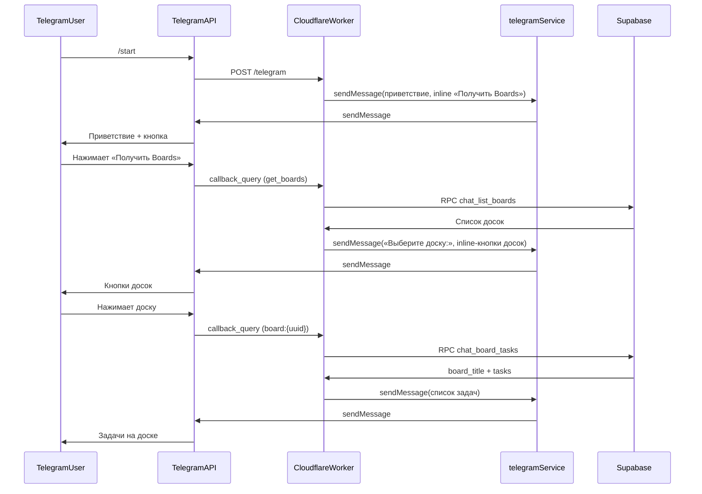

# Коммит: Telegram-бот — доски и задачи из Supabase

**Коммит:** `6248218`  
**Сообщение:** Расширен Telegram-бот: доски и задачи из Supabase через inline-кнопки.  
**Дата:** 28.06.2026

## Кратко

Telegram webhook-бот расширен интеграцией с Supabase. Пользователь может получить список досок и задачи на выбранной доске через inline-кнопки.

**Сценарий использования:**

1. `/start` — приветствие и inline-кнопка **«Получить Boards»**
2. Нажатие **«Получить Boards»** — сообщение «Выберите доску:» и inline-кнопки с названиями досок
3. Нажатие на доску — список задач этой доски с названием и статусом

Кнопка **«Получить Boards»** показывается только при `/start` (и при ошибках конфигурации). После списка досок и задач повторно не отображается.

## Изменённые и добавленные файлы

| Файл | Назначение |
|------|------------|
| `src/routes/telegram.ts` | Обработка `/start`, callback `get_boards`, выбор доски, загрузка задач |
| `src/services/telegram.ts` | Inline-клавиатуры, callback_query, форматирование списка задач |
| `src/services/supabase.ts` | `getAllBoards`, `getBoardTasks` через Supabase RPC |
| `test/telegram.spec.ts` | Интеграционные тесты (12 сценариев) |
| `docs/commit-telegram-bot.md` | Документация по коммиту |

### Миграции Supabase (применены через MCP)

| Функция | Назначение |
|---------|------------|
| `chat_list_boards()` | Возвращает все доски (`SECURITY DEFINER`, обход RLS) |
| `chat_board_tasks(p_board_id)` | Возвращает JSON с `board_title` и массивом `tasks` для доски |

> Прямой `GET /rest/v1/boards` с anon-ключом не используется — RLS блокирует чтение без авторизованного пользователя.

## Архитектура



### Поток обработки

1. Telegram отправляет `POST` на `/telegram` с телом `Update`.
2. Проверяется заголовок `X-Telegram-Bot-Api-Secret-Token`.
3. `chat_id` извлекается из `message`, `callback_query.message` или `callback_query.from`.
4. **`/start`** — приветствие + inline-кнопка «Получить Boards».
5. **`callback_query` с `data = get_boards`** — загрузка досок, ответ «Выберите доску:» + inline-кнопки (по одной доске в ряд).
6. **`callback_query` с `data = board:{uuid}`** — загрузка задач доски, ответ со списком задач.
7. Прочие сообщения игнорируются (ответ `200 ok` без вызова Telegram API).
8. При ошибке callback пользователю отправляется сообщение «Не удалось выполнить действие…».

### Формат ответа с задачами

```
Задачи на доске «boardtest1»:

1. Test Task Pers1 (backlog)

2. Test Task Pers2 (todo)
```

Если задач нет: `На доске «{название}» задач пока нет.`

## API

### `POST /telegram`

**Заголовки:**

- `Content-Type: application/json`
- `X-Telegram-Bot-Api-Secret-Token` — обязателен

**Тело:** объект Telegram [Update](https://core.telegram.org/bots/api#update).

**Обрабатываемые типы апдейтов:**

| Тип | Условие | Действие |
|-----|---------|----------|
| `message` | текст `/start` | Приветствие + кнопка «Получить Boards» |
| `callback_query` | `data = get_boards` | Список досок как inline-кнопки |
| `callback_query` | `data = board:{uuid}` | Список задач выбранной доски |

## Переменные окружения

| Переменная | Описание |
|------------|----------|
| `TELEGRAM_BOT_TOKEN` | Токен бота от [@BotFather](https://t.me/BotFather) |
| `TELEGRAM_WEBHOOK_SECRET` | Секрет webhook |
| `SUPABASE_URL` | URL проекта Supabase |
| `SUPABASE_ANON_KEY` или `SUPABASE_SERVICE_ROLE_KEY` | API-ключ для RPC-функций |

## Деплой

Worker:

- **URL:** `https://backend.2385390-by.workers.dev`
- **Webhook:** `https://backend.2385390-by.workers.dev/telegram`

```bash
npm run deploy
```

## Тесты

Файл `test/telegram.spec.ts` — 12 сценариев:

- `/start` с inline-кнопкой «Получить Boards»
- игнорирование посторонних сообщений
- выбор досок по callback `get_boards`
- загрузка задач по callback `board:{uuid}`
- проверки webhook secret, JSON, HTTP-методов, env
- обработка ошибок Telegram API

```bash
npm test
```

## Что не входит в коммит

- Long polling — только webhook.
- Фильтрация досок по пользователю — возвращаются все доски из БД.
- Обработка `edited_message` и прочих типов апдейтов — игнорируются.
- Повторная кнопка «Получить Boards» после результатов — не показывается.
